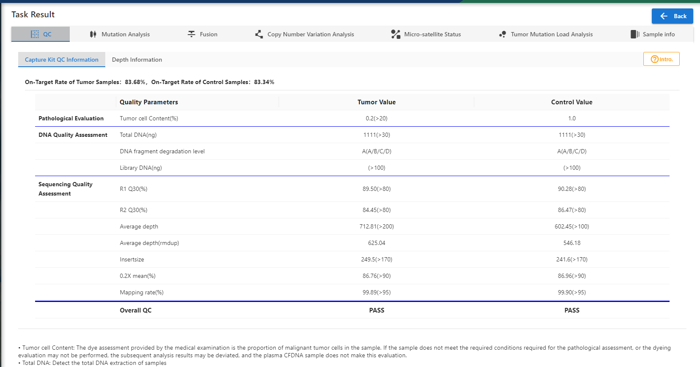
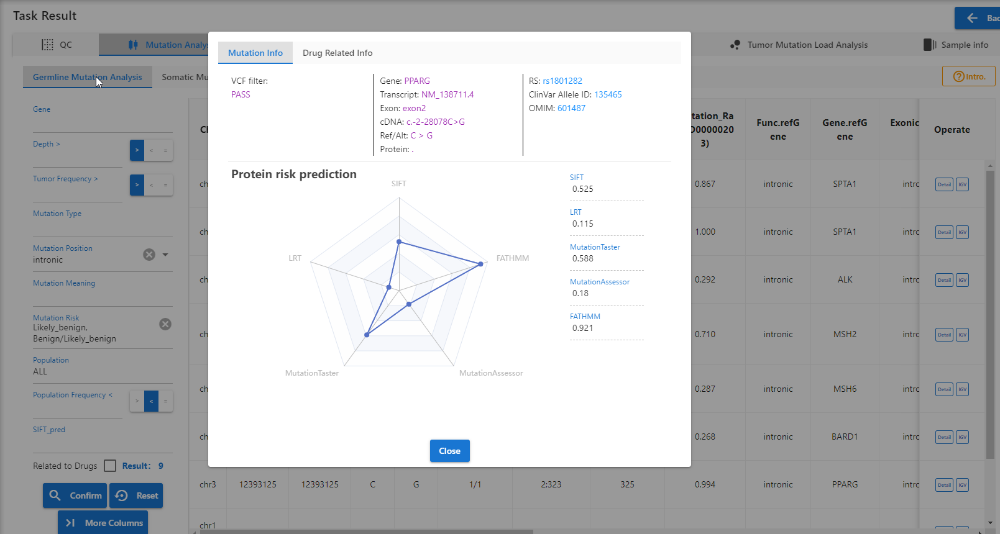
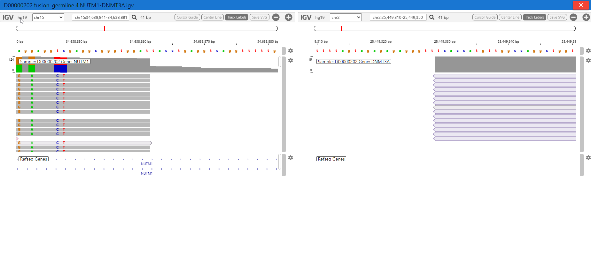
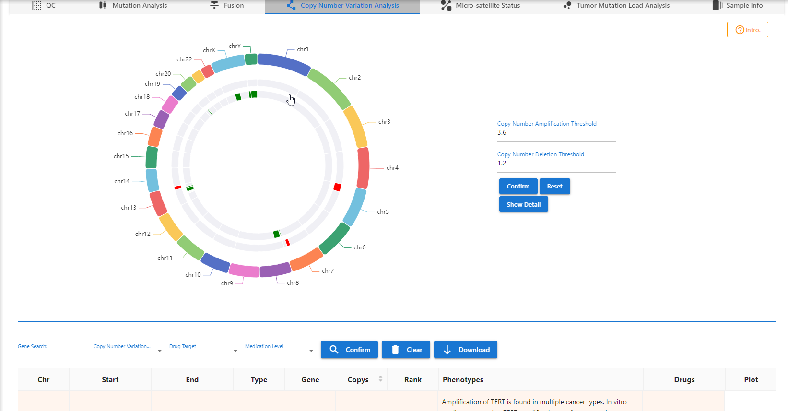
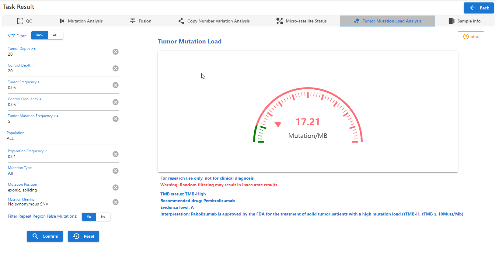

# Bioinfomatics Analysis System
A comprehensive analysis tool for genomics analysis and reporting.

## Architecture
- Python3
- [Django](https://www.djangoproject.com/) 
- [Django Restful Framework](https://www.django-rest-framework.org/) : A powerful and flexible toolkit for building Web APIs.
- [APScheduler](https://github.com/agronholm/apscheduler) : A task scheduler and task queue system for Python
- PostgresSQL

## Features
- Platform Overview
- Project Management
- Task Management
  - Quality Control
  - Fusion
  - Copy Number Variation
  - Homologous Recombination Defect
  - Micro-satellite Instability
  - Mutation
  - Pathogen
  - Tumor Mutation Load
  - Common Analysis Module
- Custom Report
- Patient Management
- Sample Management
- Data Management
- Panel Flow Intra
- Genome Browser

## Demo snapshots

